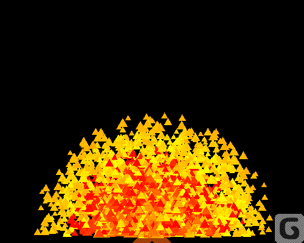
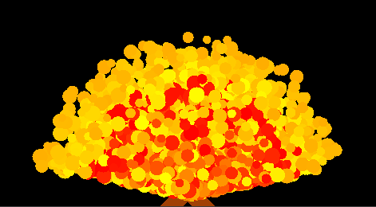
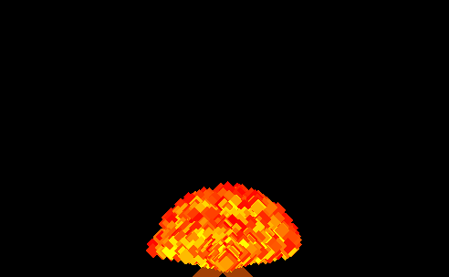

# SFML_Fireparticles

A small fire particle system for SFML, using a EventManager singleton

Showcase:
A fire composed of triangles  

You can easily change the shape  

You can also change things such as spread and speed and life time. You can't change the colour, but that's not a difficult to change  
 

The most "realistic" fire my system can produce  

## Dependecy

To install from source you need:   
SFML 2.5.1
TGUI-0.8 (GUI for SFML) 
